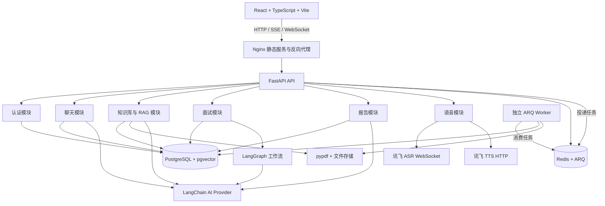
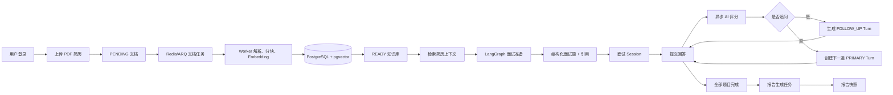
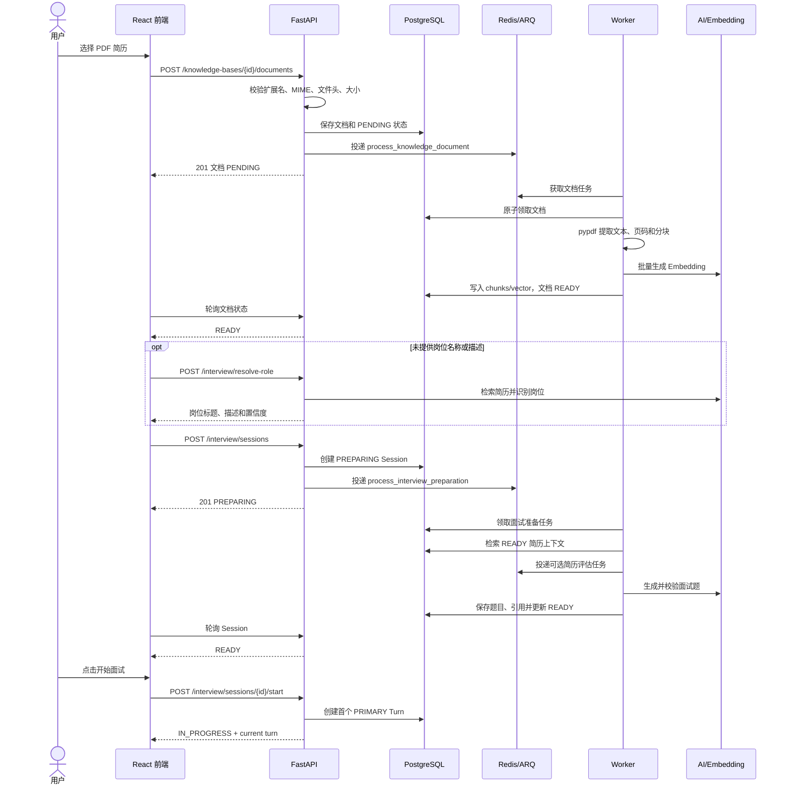
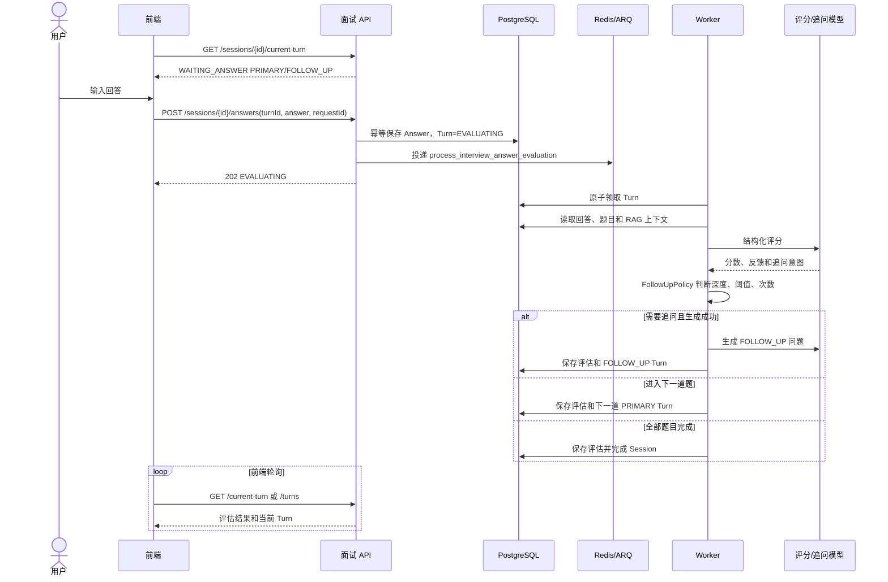
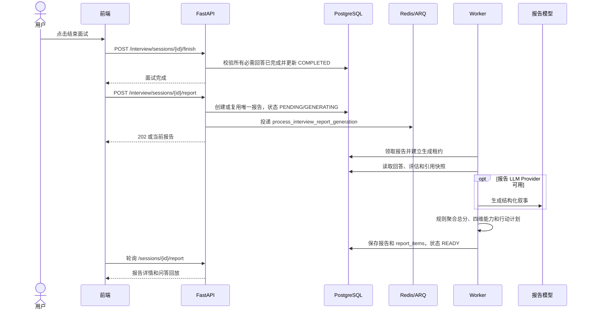
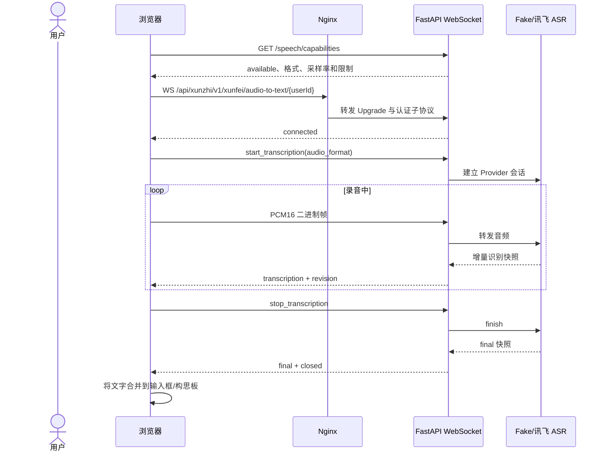
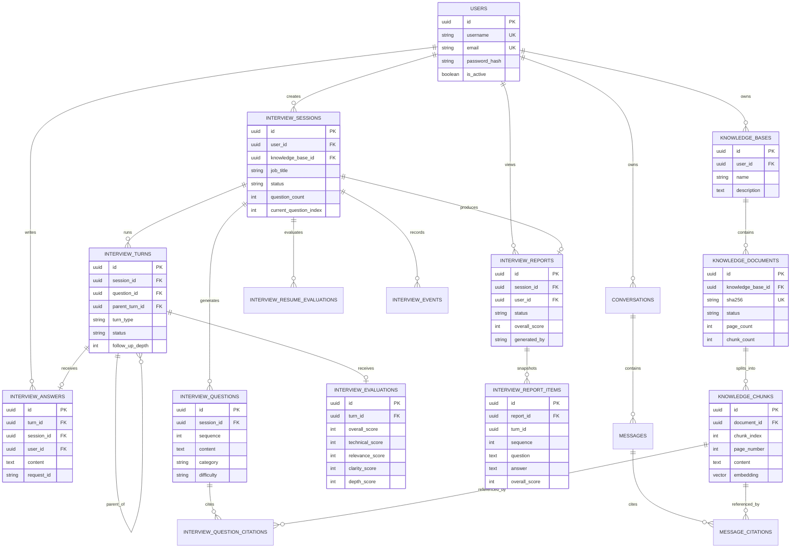

# 智能模拟面试平台项目说明书

> 文档版本：1.0
> 生成日期：2026-08-31
> 适用项目版本：当前 `master` 分支，源码基线 `344e553`（`fix: optimize interview preparation flow`）
> 适用范围：项目根目录（`.`）

本说明书依据当前项目源码、配置示例、Docker Compose 文件、Alembic 迁移、自动化测试和现有项目文档整理。文中将功能明确区分为“已实现”“可选功能”和“后续规划”；没有把操作手册或历史规划中尚未落地的内容当作当前能力。

## 目录

- [1. 项目概述](#1-项目概述)
- [2. 技术架构](#2-技术架构)
- [3. 功能模块](#3-功能模块)
- [4. 核心业务流程](#4-核心业务流程)
- [5. 项目目录结构](#5-项目目录结构)
- [6. 数据库设计](#6-数据库设计)
- [7. API 说明](#7-api-说明)
- [8. 配置说明](#8-配置说明)
- [9. 本地运行](#9-本地运行)
- [10. 测试与质量检查](#10-测试与质量检查)
- [11. 部署说明](#11-部署说明)
- [12. 安全设计](#12-安全设计)
- [13. 常见问题与排查](#13-常见问题与排查)
- [14. 当前限制与后续规划](#14-当前限制与后续规划)
- [15. 源码核验记录](#15-源码核验记录)

## 1. 项目概述

### 1.1 项目背景与目标

“寻知”是一个面向求职者的智能模拟面试平台。用户上传 PDF 简历后，系统将简历解析为可检索的知识库内容，根据目标岗位生成结构化面试题，并提供逐题作答、AI 评分、动态追问和面试报告能力。

项目目标是把简历、岗位要求和面试过程统一到一个可恢复的业务链路中：

```text
注册/登录
  → 上传 PDF 简历
  → 解析、分块并建立知识库
  → 识别或填写目标岗位
  → 异步生成面试题
  → 进入模拟面试
  → 提交回答并异步评分
  → 按策略生成追问或进入下一题
  → 结束面试并生成报告
```

### 1.2 主要应用场景

- 求职者在正式面试前进行岗位定制练习。
- 使用个人简历进行技术、行为或混合类型面试训练。
- 通过 RAG（Retrieval-Augmented Generation，检索增强生成）让题目和回答分析引用简历中的实际内容。
- 通过历史面试、逐题反馈和报告复盘表达、技术深度、相关性和清晰度。
- 在普通 AI 对话中选择知识库，让回答基于指定的简历或资料。

### 1.3 核心功能

| 功能 | 当前状态 | 说明 |
| --- | --- | --- |
| 用户注册、登录、刷新和退出 | 已实现 | Bearer Access Token、Refresh Token 和当前用户查询。 |
| 普通 AI 对话 | 已实现 | 支持 SSE 流式回复、历史会话和可选 RAG 引用。 |
| PDF 简历导入 | 已实现 | 上传、校验、存储、异步解析、分块和 Embedding。 |
| 简历知识库 | 已实现 | 用户隔离的知识库、文档状态和文档删除。 |
| 岗位识别 | 已实现/可选 | 需要 AI 能力；无可用模型时返回安全的综合岗位回退结果。 |
| 面试题生成 | 已实现 | LangGraph 编排，题目生成异步执行，支持题量、难度、类别和来源校验。 |
| 模拟面试 | 已实现 | Session、Turn、Answer、Evaluation 状态持久化。 |
| 动态追问 | 已实现/可选 | AI 生成候选追问，再由深度、分数和会话次数策略决定是否采用。 |
| AI 评分与反馈 | 已实现/可选 | AI 可用时生成结构化评分；无可用模型时记录不可用或失败状态。 |
| 面试报告 | 已实现 | 支持规则、LLM 或混合生成，报告保存为可复盘快照。 |
| 语音转写 | 已实现接口和前端链路/需配置 | WebSocket + PCM16；默认配置为不可用，讯飞凭据必须在后端配置。 |
| 语音合成 | 已实现接口和前端播放/需配置 | 支持 Fake WAV 或讯飞；任务结果是短期内存记录。 |
| 摄像头预览 | 已实现 | 浏览器本地 `getUserMedia` 预览、关闭和截图。 |
| 神态分析 | 前端尝试接入，后端未完成 | 当前后端没有匹配的 `demeanor-evaluation` 路由，不能视为可用的服务端分析能力。 |
| 历史会话和历史面试 | 已实现 | 普通对话、面试会话、报告均可分页查询。 |

### 1.4 当前完成情况

当前仓库是一个 MVP 发布候选版本，具备可运行的 React/Vite 前端、FastAPI 后端、PostgreSQL/pgvector、Redis、后台 Worker、数据库迁移和自动化测试。项目 README 明确支持三类运行模式：

- `unavailable`：安全默认模式，不调用外部 AI 或语音服务。
- `fake`：仅用于开发、测试和 E2E 的确定性适配器。
- `openai_compatible` 或 `xunfei`：按配置连接真实模型或讯飞服务。

代码中已经将面试准备拆分为“题目准备关键路径”和“简历评估后台任务”：简历评估失败不会阻断题目准备进入 `READY`。前端的营销首页当前保留一个背景视频和平台介绍内容，历史截图中的“项目演示”卡片不在当前 `MarketingHomePage.tsx` 结构中。

### 1.5 系统特色

- **结构化 AI 输出**：AI 题目、评分、简历评估、岗位识别和报告叙事均通过 Pydantic 模型校验。
- **异步长任务**：PDF 导入、面试准备、答题评分和报告生成由 ARQ Worker 执行，HTTP 请求不长时间阻塞等待模型。
- **数据库为事实源**：PostgreSQL 保存业务状态；LangGraph 只负责流程编排，Redis 只负责队列、临时状态、限流和相关基础能力。
- **可追溯 RAG**：检索结果带有文档、页码、分块和相似度信息，题目和聊天消息可保存引用。
- **幂等与恢复**：会话创建、答案提交、报告生成和后台任务均有请求编号、唯一约束或恢复逻辑。
- **安全默认值**：真实密钥只在后端环境变量中读取，默认外部服务不可用，生产环境禁止 Fake Provider。

## 2. 技术架构

### 2.1 技术栈

| 层次 | 技术 | 在本项目中的职责 |
| --- | --- | --- |
| 前端 | React 19、TypeScript、Vite | 页面、路由、状态管理、HTTP/SSE/WebSocket 和浏览器媒体能力。 |
| UI | Tailwind CSS、Radix UI、Lucide React | 页面布局、表单、弹层、按钮和图标。 |
| 前端数据 | Redux Toolkit、React Query、Axios | 用户状态、服务端查询缓存、请求和 Token 刷新。 |
| 后端 API | FastAPI、Uvicorn | REST API、SSE 流式响应、认证 WebSocket 和健康检查。 |
| 数据校验 | Pydantic v2、Pydantic Settings | API DTO、配置校验和 AI 结构化输出。 |
| ORM/迁移 | SQLAlchemy 2 Async、Alembic、asyncpg | 异步数据库访问和版本化迁移。 |
| 主数据库 | PostgreSQL 16 | 用户、聊天、知识库、面试、评分和报告等业务事实。 |
| 向量能力 | pgvector | 在 PostgreSQL 中保存 1536 维 Embedding 并进行相似度检索。 |
| 临时状态/队列 | Redis 7、ARQ | 后台任务队列、刷新会话、临时状态、限流和恢复辅助。 |
| AI 编排 | LangChain、LangGraph | 模型适配、结构化输出、检索上下文和多步骤工作流。 |
| PDF | pypdf | PDF 页面文本提取和页码保留。 |
| 语音 | websockets、讯飞 IAT/TTS 适配器 | 语音转写 WebSocket 和语音合成。 |
| 容器 | Docker、Docker Compose、Nginx | API、Worker、迁移、前端静态服务、PostgreSQL 和 Redis 编排。 |
| 测试 | pytest、httpx、pytest-asyncio、Vitest、Testing Library、Playwright | 后端单元/API/集成测试、前端测试和 E2E。 |

### 2.2 分层结构

后端遵循 Router → Service → Repository 的分层约束。Router 负责 HTTP 参数和响应，Service 负责用例编排，Repository 负责数据库读写，Domain 保存领域对象和状态规则，Infrastructure 负责文件、向量和外部服务适配。



### 2.3 主要数据流



### 2.4 AI 与外部服务适配

`backend-python/app/ai/factory.py` 根据配置创建 Chat、Embedding、面试题、回答评分、追问、简历评估、岗位识别和报告叙事适配器。当前 Provider 选择如下：

- `unavailable`：返回安全的不可用行为，不建立真实外部调用。
- `fake`：用于测试和 E2E，生成确定性结果；生产环境配置校验会拒绝。
- `openai_compatible`：使用 LangChain OpenAI-compatible 适配器，需要 API Key、Base URL 和模型名。
- 语音转写单独支持 `unavailable`、`fake`、`xunfei`。
- 语音合成单独支持 `unavailable`、`fake`、`xunfei`。

题目生成支持可选的 `APP_INTERVIEW_QUESTION_MODEL`，未配置时复用 `APP_LLM_MODEL`。Embedding 数据库迁移固定使用 1536 维向量；模型返回的维度必须与配置一致。

## 3. 功能模块

### 3.1 用户注册、登录与认证

- **用途**：创建用户、登录、刷新 Access Token、退出并查询当前用户。
- **主要流程**：注册时校验用户名和邮箱唯一性并安全哈希密码；登录返回 Access/Refresh Token；刷新时校验 Refresh Token 对应的 Redis 会话；受保护接口从 Bearer Token 解析当前用户。
- **前端位置**：`frontend/src/pages/auth/AuthPage.tsx`、`frontend/src/hooks/auth/useAuthPageController.ts`、`frontend/src/services/authService.ts`、`frontend/src/lib/authToken.ts`。
- **后端位置**：`backend-python/app/api/v1/router.py`、`backend-python/app/modules/auth/`、`backend-python/app/core/security.py`。
- **依赖服务**：PostgreSQL 保存用户；Redis 保存可刷新/撤销的会话状态。
- **限制**：Refresh Token 存储在浏览器本地存储；实际生产部署仍应结合 HTTPS、密钥轮换和更严格的 Cookie/浏览器策略评估。

### 3.2 普通 AI 对话

- **用途**：提供不绑定面试 Session 的通用 AI 对话。
- **主要流程**：创建会话 → 发送消息 → 服务端以 SSE 返回 `start`、`delta`、`complete` 或 `error` 事件 → 消息和可选引用持久化。
- **前端位置**：`frontend/src/pages/chat/ChatPage.tsx`、`frontend/src/components/chat/`、`frontend/src/hooks/chat/`、`frontend/src/services/aiService.ts`。
- **后端位置**：`backend-python/app/api/v1/chat.py`、`backend-python/app/modules/chat/`、`backend-python/app/ai/chat.py`。
- **依赖服务**：PostgreSQL、AI Provider；选择知识库时额外依赖 Embedding Provider 和 pgvector。
- **限制**：无真实 AI 配置时会安全失败；SSE 是流式传输，不等于后台任务完成通知；RAG 无结果时默认按 `APP_RAG_NO_RESULT_POLICY=answer_without_context` 继续回答。

### 3.3 PDF 简历上传、解析与预览

- **用途**：接收 PDF 简历，提取页面文字并提供面试页预览。
- **主要流程**：校验扩展名、MIME、PDF 文件头和大小 → 生成安全存储名并保存原文件 → 创建 `PENDING` 文档 → 投递 `process_knowledge_document` → Worker 使用 pypdf 提取文本、分块、Embedding 并写入 pgvector → 文档变为 `READY` 或 `FAILED`。
- **前端位置**：`frontend/src/components/interview/InterviewResumeUploadCard.tsx`、`frontend/src/hooks/interview/resume/`、`frontend/src/services/interviewService.ts`、`frontend/src/features/knowledge/`。
- **后端位置**：`backend-python/app/api/v1/knowledge.py`、`backend-python/app/modules/knowledge/`、`backend-python/app/infrastructure/storage/`、`backend-python/app/workers/worker.py`。
- **依赖服务**：PostgreSQL、Redis、共享 `knowledge-storage` 文件卷、pypdf、Embedding Provider。
- **限制**：默认最大文件大小为 20 MiB；空 PDF、加密 PDF、图片型 PDF 或无法提取页面文字的文件会失败；当前没有 OCR 能力；Embedding 维度必须是数据库列支持的 1536 维。

### 3.4 简历知识库和 RAG 检索

- **用途**：将简历文档拆成带页码的文本块，并按用户和知识库范围检索相关内容。
- **主要流程**：创建知识库 → 上传文档 → 等待 `READY` → 以查询文本生成向量 → 只检索当前用户指定知识库中的 `READY` 分块 → 按相似度、`top_k` 和上下文 token 上限组装引用。
- **前端位置**：`frontend/src/features/knowledge/`、`frontend/src/pages/chat/ChatPage.tsx`、`frontend/src/services/aiService.ts`。
- **后端位置**：`backend-python/app/modules/knowledge/`、`backend-python/app/infrastructure/vectorstore/`、`backend-python/app/modules/chat/context.py`、`backend-python/app/modules/interview/context.py`。
- **依赖服务**：PostgreSQL + pgvector、Embedding Provider。
- **限制**：当前实现以 pgvector 向量检索为主；知识库删除会级联删除其文档和分块；RAG 上下文受 token 上限限制；未配置 Embedding 时不能使用真实知识库向量导入/检索。

### 3.5 岗位识别

- **用途**：从已准备好的简历知识库推断面试岗位方向。
- **主要流程**：调用 `POST /api/xunzhi/v1/interview/resolve-role`，检索简历上下文并调用结构化岗位识别模型；模型不可用时返回 `综合岗位` 回退标题，`inferred=false`。
- **前端位置**：`frontend/src/hooks/interview/resume/useInterviewResumeAnalysis.ts`、`frontend/src/services/interviewService.ts`。
- **后端位置**：`backend-python/app/api/v1/interview.py`、`backend-python/app/modules/interview/service.py`、`backend-python/app/ai/resume.py`。
- **依赖服务**：READY 知识库、Embedding、AI Provider。
- **限制**：调用方同时提供岗位名称和描述时，前端会跳过岗位推断；当前没有基于文档哈希的持久化岗位推断缓存；推断结果属于面试创建过程的输入，不是独立岗位实体。

### 3.6 面试题生成

- **用途**：根据简历、岗位、面试类型和难度生成带来源的结构化题目。
- **主要流程**：创建 Session → 状态变为 `PREPARING` 并立即返回 → Worker 执行上下文检索、投递简历评估任务、题目生成、结构化校验和题目/引用持久化 → Session 进入 `READY` 或 `FAILED`。
- **校验内容**：题目数量与请求一致、题目唯一、难度匹配、考察点非空、来源编号必须来自检索结果。
- **前端位置**：`frontend/src/pages/interview/InterviewIntroPage.tsx`、`frontend/src/components/interview/InterviewResumeUploadCard.tsx`、`frontend/src/hooks/interview/resume/`、`frontend/src/services/interviewService.ts`。
- **后端位置**：`backend-python/app/modules/interview/workflow.py`、`backend-python/app/modules/interview/service.py`、`backend-python/app/ai/interview.py`、`backend-python/app/workers/worker.py`。
- **依赖服务**：Redis/ARQ Worker、PostgreSQL、READY 简历知识库、Embedding、AI Provider。
- **限制**：题量范围为 3–20，默认 5；真实模型耗时取决于外部服务、上下文大小和重试；AI 不可用时无法生成真实题目；简历评估是独立可选任务，失败不阻断题目进入 `READY`，但其结果可能不可用。

### 3.7 模拟面试、回答提交和动态追问

- **用途**：按 PRIMARY 和 FOLLOW_UP 两类 Turn 进行逐题问答。
- **主要流程**：`READY` Session 开始后创建首个 Turn → 用户查询 `current-turn` → 以 `turnId`、回答文本和稳定 `requestId` 提交 → 回答先持久化，Turn 进入 `EVALUATING` → Worker 评分 → FollowUpPolicy 判断追问、下一题或完成 Session。
- **前端位置**：`frontend/src/pages/interview/InterviewPage.tsx`、`frontend/src/hooks/interview/session/`、`frontend/src/components/chat/SmartComposer.tsx`、`frontend/src/services/interviewService.ts`。
- **后端位置**：`backend-python/app/api/v1/interview.py`、`backend-python/app/modules/interview/answer_service.py`、`backend-python/app/modules/interview/answer_workflow.py`、`backend-python/app/modules/interview/follow_up.py`、`backend-python/app/modules/interview/state_machine.py`。
- **依赖服务**：PostgreSQL、Redis/ARQ Worker、AI 评分和追问 Provider、Embedding/RAG 上下文。
- **限制**：回答长度默认 10–10000 字符；追问最大深度默认 2、单场最多 5 次、评分阈值默认 70；异步评分未完成时不能继续推进同一轮；重复或状态冲突会返回 409。

### 3.8 AI 评分与反馈

- **用途**：对每个回答生成总分、技术性、相关性、清晰度、深度、优点、弱点和改进建议。
- **主要流程**：Worker 加载回答和上下文 → AI 返回 `StructuredInterviewEvaluation` → 校验分数和字段 → 保存评估 → 应用追问策略并创建后续 Turn。
- **前端位置**：`frontend/src/components/chat/ChatRoom.tsx`、`frontend/src/hooks/interview/session/`、`frontend/src/services/interviewService.ts`。
- **后端位置**：`backend-python/app/ai/evaluation.py`、`backend-python/app/modules/interview/answer_workflow.py`、`backend-python/app/workers/worker.py`。
- **依赖服务**：AI Provider；按配置还会检索 pgvector 上下文。
- **限制**：无真实 AI Provider 时，评分任务会记录不可用/失败；结构化输出不合法时会被拒绝，不能保证每次都产生评分；评分不是同步 HTTP 响应内容的一部分。

### 3.9 面试报告

- **用途**：聚合面试回答和单题评分，展示能力雷达、优势、弱点、改进建议、行动计划和问答回放。
- **主要流程**：只有 `COMPLETED` Session 才能生成报告 → 创建或复用唯一报告记录 → Worker 生成规则/LLM/混合报告 → 保存报告及报告条目快照 → 前端轮询至 `READY`。
- **前端位置**：`frontend/src/pages/interview/InterviewReportPage.tsx`、`frontend/src/pages/interview/InterviewReportDetailPage.tsx`、`frontend/src/components/interview/report/`、`frontend/src/hooks/interview/report/`。
- **后端位置**：`backend-python/app/modules/report/`、`backend-python/app/api/v1/interview.py`、`backend-python/app/workers/worker.py`、`backend-python/app/ai/report.py`。
- **依赖服务**：PostgreSQL；可选 AI 报告 Provider；Redis/ARQ Worker。
- **限制**：报告要求面试完成并有已完成回答；报告中的 `turn_id` 和来源是快照逻辑关系，报告不依赖原知识库文档继续存在；“打印报告”是浏览器打印样式，不是服务端 PDF 导出。

### 3.10 语音转写

- **用途**：将麦克风采集的实时 PCM16 音频转换成增量文字，并填入聊天输入框或面试构思板。
- **主要流程**：登录后查询能力 → 浏览器通过认证 WebSocket 连接 → 发送 `start_transcription` → 发送 16 kHz、单声道、PCM16 little-endian 二进制帧 → 接收 `transcription` 增量快照和 `final` 最终快照 → 发送 `stop_transcription`。
- **前端位置**：`frontend/src/hooks/audio/`、`frontend/src/hooks/useAudioToText.ts`、`frontend/src/services/audioToTextWs.ts`、`frontend/src/lib/audioTranscription.ts`、`frontend/src/components/audio/MicrophoneControl.tsx`。
- **后端位置**：`backend-python/app/api/v1/speech.py`、`backend-python/app/modules/speech/`、`backend-python/app/infrastructure/speech/`。
- **依赖服务**：浏览器麦克风权限、Nginx WebSocket 代理、讯飞 IAT 或 Fake Provider。
- **限制**：`.env.example` 默认 `APP_SPEECH_TO_TEXT_PROVIDER=unavailable`；最大会话默认 120 秒、单帧 64 KiB、总音频 5 MiB；只接受配置声明的 PCM16/16 kHz/单声道格式；语音结果只填充输入，不会自动提交回答。

### 3.11 语音合成

- **用途**：将 AI 消息转换为可播放音频。
- **主要流程**：前端查询 TTS 能力 → 调用同步 `synthesize` 或兼容 `tasks` 接口 → 后端校验文本、音频格式、发音人、限流和幂等 → Provider 返回音频 → 后端以 Base64 返回 → 前端创建/复用 Object URL 播放。
- **前端位置**：`frontend/src/hooks/audio/useTtsCapabilities.ts`、`frontend/src/hooks/audio/useChatTtsPlayback.ts`、`frontend/src/services/ttsService.ts`、`frontend/src/services/xunfeiTtsService.ts`。
- **后端位置**：`backend-python/app/api/v1/speech.py`、`backend-python/app/modules/speech/tts_service.py`、`backend-python/app/infrastructure/speech/tts_xunfei.py`、`tts_fake.py`。
- **依赖服务**：讯飞 TTS 或 Fake Provider；前端浏览器音频播放。
- **限制**：默认不可用；任务记录只存在进程内存并按 TTL 清理，不是持久化队列；默认文本上限 10000 字符、音频上限 5 MiB、每用户每分钟 30 次；服务重启后短期任务结果不会保留。

### 3.12 摄像头与神态分析

- **摄像头预览已实现**：`CameraPreview.tsx` 使用 `navigator.mediaDevices.getUserMedia` 获取视频流，支持关闭、展开和从视频帧生成 JPEG Blob。面试页默认打开摄像头，可手动关闭。
- **神态分析当前限制**：`useInterviewDemeanorPolling.ts` 每 5 秒调用前端 `evaluateInterviewDemeanor`，请求路径为 `/api/xunzhi/v1/interview/sessions/{sessionId}/demeanor-evaluation`；当前 FastAPI 面试路由中没有该接口，也没有神态分析 Provider 或数据库实体。因此该轮询当前会失败并在前端控制台记录错误，不能描述为已完成的服务端神态分析。
- **安全提示**：摄像头权限由浏览器管理；正式环境应使用 HTTPS 或 localhost，并明确告知用户视频帧是否上传及保存策略。

### 3.13 历史会话和历史面试

- **普通对话历史**：侧边栏从聊天会话和消息接口分页加载，支持打开、结束、删除和查看消息。
- **面试历史**：面试介绍页和侧边栏从面试会话/会话摘要接口加载，报告页从报告分页接口加载。
- **前端位置**：`frontend/src/components/layout/sidebar/`、`frontend/src/hooks/layout/`、`frontend/src/hooks/interview/records/`。
- **后端位置**：`backend-python/app/api/v1/chat.py`、`backend-python/app/api/v1/interview.py`、对应 chat/interview/report Service 和 Repository。
- **限制**：所有历史查询按当前用户过滤；分页大小由接口限制为 1–100；问答报告是快照，原始知识库删除不会恢复或更新已生成报告。

## 4. 核心业务流程

### 4.1 从上传简历到进入面试



说明：简历评估任务与题目准备任务使用独立数据库会话；题目准备不再等待简历评估模型完成。简历评估状态可能是 `PENDING`、`EVALUATING`、`COMPLETED`、`FAILED` 或 `UNAVAILABLE`，但其失败不会让已经生成成功的题目回退。

### 4.2 面试题生成流程

1. `InterviewService.create_session` 校验知识库、岗位、面试类型、难度和题量，题量范围为 3–20，默认 5。
2. Session 以 `PREPARING` 状态进入 ARQ 队列，API 不同步等待模型。
3. `InterviewPreparationWorkflow` 通过 LangGraph 执行：加载 Session → 校验知识库 → 检索上下文 → 安排简历评估 → 构造生成上下文 → 生成题目 → 校验题目 → 保存题目和引用 → 标记 `READY`。
4. 题目校验失败、知识库不可用或队列/模型失败时，Session 记录安全失败代码和消息；可重试错误由 ARQ 按配置重试。
5. Worker 启动时会恢复待处理和超时的准备任务，避免服务重启后永久停留在处理中。

### 4.3 回答、评分、追问和下一题



答案提交使用 `requestId` 幂等键。同一个 Session 中重复使用相同请求编号且内容一致时应复用已有结果；相同请求编号对应不同内容或当前 Turn 已被其他请求推进时，会触发冲突处理。

### 4.4 面试结束与报告生成



如果报告叙事模型未配置或输出无效，报告服务使用规则化叙事并将 `generatedBy` 标为 `RULES`；因此报告本身不必依赖真实大模型才能完成。

### 4.5 语音转写流程



语音转写不会自动提交文本。若 `available=false`，前端会禁用录音入口；若要接入真实讯飞，必须将 ASR 凭据配置在后端，不能放在 Vite 前端环境变量中。

## 5. 项目目录结构

以下只列出对开发和运维重要的目录与文件。

```text
智能模拟面试平台/
├─ frontend/                         # React + TypeScript + Vite 前端
│  ├─ src/
│  │  ├─ api/generated.ts            # 从 FastAPI OpenAPI 生成的类型，禁止手工编辑
│  │  ├─ app/                        # Router 和全局 Provider
│  │  ├─ components/                 # 页面和通用 UI 组件
│  │  ├─ features/knowledge/         # 知识库前端功能
│  │  ├─ hooks/                      # 聊天、面试、语音、摄像头和报告状态逻辑
│  │  ├─ pages/                      # 登录、首页、聊天、面试和报告页面
│  │  ├─ services/                   # HTTP、SSE、TTS、ASR 和面试 API 封装
│  │  ├─ store/                      # Redux Store 和 Slice
│  │  └─ lib/                        # Token、媒体、错误、常量和工具
│  ├─ e2e/                           # Playwright 端到端测试
│  ├─ scripts/generate-openapi.mjs   # 生成前端 OpenAPI 类型
│  ├─ Dockerfile                     # Vite 构建 + Nginx 运行镜像
│  ├─ nginx.conf                     # 静态服务、API 反代和 WebSocket 反代
│  ├─ package.json                   # 前端脚本和依赖
│  └─ .env.example                   # 前端安全配置示例
├─ backend-python/                   # FastAPI + Python 后端
│  ├─ app/main.py                    # FastAPI 应用、生命周期、路由和健康检查
│  ├─ app/api/v1/                    # HTTP/WebSocket Router
│  ├─ app/core/                      # 配置、数据库、Redis、安全和统一异常
│  ├─ app/ai/                        # AI/Embedding 端口、结构化模型和 Provider 工厂
│  ├─ app/modules/auth/              # 用户认证领域、服务、仓储和模型
│  ├─ app/modules/chat/              # 对话、SSE、RAG 聊天和引用
│  ├─ app/modules/knowledge/         # 知识库、PDF 导入、分块和检索
│  ├─ app/modules/interview/         # 面试 Session、题目、Turn、评分和工作流
│  ├─ app/modules/report/            # 报告聚合、快照和报告服务
│  ├─ app/modules/speech/            # ASR/TTS 服务、Schema 和 Provider 依赖
│  ├─ app/infrastructure/            # 文件存储、PDF、向量库和语音适配器
│  ├─ app/workers/                   # ARQ 队列、Worker、任务和恢复逻辑
│  ├─ alembic/versions/              # 0001–0013 数据库迁移
│  ├─ tests/                         # 单元、API 和集成测试
│  ├─ scripts/                       # 集成测试和 RAG 评估入口
│  ├─ Dockerfile                     # 后端/Worker 基础镜像
│  ├─ pyproject.toml                 # Python 依赖、pytest、Ruff、mypy 配置
│  ├─ alembic.ini                    # Alembic 配置入口
│  └─ .env.example                   # 后端安全配置示例
├─ docs/release-checklist.md         # MVP 发布验收清单
├─ evals/rag/                        # RAG 数据集、评估脚本和结果
├─ docker-compose.yml                # 普通本地/演示 Compose
├─ compose.e2e.yml                   # 独立 E2E 端口、数据和 Fake Provider
├─ compose.integration.yml            # 集成测试 Compose 配置
├─ compose.rag-eval.yml              # RAG 评估 Compose 配置
├─ compose.real-smoke.yml            # 真实服务冒烟配置
├─ README.md                         # 项目配置、运行、API 和质量检查说明
└─ AGENTS.md                         # 当前仓库开发约束
```

## 6. 数据库设计

### 6.1 设计原则

- PostgreSQL 是业务事实来源，所有核心状态写入数据库。
- UUID 是主要实体主键，时间字段使用带时区的 `DateTime`。
- 用户、知识库、文档、聊天、面试和报告通过 `user_id` 或外键关联，并在 Repository 层再次校验归属。
- pgvector 的 `knowledge_chunks.embedding` 固定为 `Vector(1536)`。
- 状态、分数、唯一请求编号和题目序号使用数据库约束辅助保证一致性。
- Redis 不保存业务事实；任务领取、重试和恢复状态最终仍写入 PostgreSQL。

### 6.2 主要数据表

| 表 | 主要字段/职责 | 关系与约束 |
| --- | --- | --- |
| `users` | 用户名、邮箱、密码哈希、启用状态 | 用户名和邮箱唯一；删除用户级联其业务数据。 |
| `conversations` | 普通对话标题、状态、模型和时间 | `user_id → users`；按用户和更新时间索引。 |
| `messages` | 消息角色、内容、序号、状态和请求编号 | `conversation_id → conversations`；同一会话序号唯一。 |
| `message_citations` | 消息引用的 chunk、文档、页码、分数和摘录 | 关联 `messages`、`knowledge_chunks`、`knowledge_documents`。 |
| `knowledge_bases` | 用户知识库名称和描述 | `(user_id, name)` 唯一；删除用户级联。 |
| `knowledge_documents` | 原始文件、SHA-256、存储路径、状态、页数、分块数、失败信息 | `knowledge_base_id → knowledge_bases`；同一知识库内 SHA-256 唯一。 |
| `knowledge_chunks` | 分块序号、页码、文本、token 数、内容哈希、1536 维向量 | `document_id → knowledge_documents`；文档内分块序号唯一。 |
| `interview_sessions` | 岗位、类型、难度、题量、当前题目索引和状态 | `user_id → users`、`knowledge_base_id → knowledge_bases`；用户请求编号唯一。 |
| `interview_resume_evaluations` | 简历匹配总分、技能/经历/证据/清晰度分数、建议和状态 | 一个 Session 一条；失败不阻断题目准备。 |
| `interview_questions` | 题目内容、类别、难度、考察点和来源摘要 | Session 内序号唯一。 |
| `interview_question_citations` | 题目引用的知识库 chunk、页码、相似度和摘录 | 题目和 chunk 组合唯一。 |
| `interview_events` | Session 状态变更、事件类型、Payload 和幂等键 | 保存可审计的状态流转记录。 |
| `interview_turns` | PRIMARY/FOLLOW_UP 问题、父 Turn、序号、状态和追问深度 | Session 内序号唯一；父 Turn 是自引用关系。 |
| `interview_answers` | 用户回答文本、Turn、Session、请求编号 | Turn 一条回答；Session 内 requestId 唯一。 |
| `interview_evaluations` | 五类分数、优缺点、反馈、改进和追问意图 | Turn 一条评估，分数范围 0–100。 |
| `interview_reports` | 总分、四维分数、雷达数据、摘要、行动计划、快照和状态 | 一个 Session 一条；可由 RULES、LLM 或 HYBRID 生成。 |
| `interview_report_items` | 报告中的问题、回答、分数、反馈和来源快照 | 报告内序号和 Turn 组合唯一；`turn_id` 是报告快照的逻辑引用。 |

### 6.3 核心实体关系



### 6.4 Alembic 迁移

迁移链从 `0001` 到 `0013`，当前 head 为 `0013_interview_report_queue`：

| 迁移 | 内容 |
| --- | --- |
| `0001_create_users` | 创建 `users`。 |
| `0002_chat_conversations_messages` | 创建普通对话和消息表。 |
| `0003_knowledge_vector_tables` | 启用 pgvector，创建知识库、文档和分块表；向量列为 1536 维。 |
| `0004_create_message_citations` | 创建聊天消息引用表。 |
| `0005_create_interview_tables` | 创建面试 Session、题目、事件和题目引用表。 |
| `0006_turns_answers_evaluations` | 创建 Turn、Answer 和 Evaluation 表。 |
| `0007_interview_reports` | 创建报告和报告条目表。 |
| `0008_resume_evaluations` | 创建简历评估表。 |
| `0009_resume_report_snapshot` | 为报告增加简历评估快照。 |
| `0010_knowledge_queue_state` | 增加知识文档队列、处理时间、尝试次数和失败状态字段。 |
| `0011_interview_preparation_queue` | 增加面试准备队列时间和尝试次数字段。 |
| `0012_interview_answer_eval_queue` | 增加答案评估队列、租约/恢复相关字段。 |
| `0013_interview_report_queue` | 增加报告生成队列、租约和恢复相关字段。 |

## 7. API 说明

除健康检查外，以下接口均以 `/api` 开头；需要认证的接口使用 `Authorization: Bearer <access-token>`。FastAPI 的统一错误响应包含错误码、消息和请求编号相关信息；下表只列出核心接口，不复制完整 OpenAPI。

### 7.1 健康检查

| 方法 | 路径 | 认证 | 作用/主要响应 |
| --- | --- | --- | --- |
| GET | `/health` | 否 | 兼容的存活别名，返回 `{"status":"ok"}`。 |
| GET | `/health/live` | 否 | 只检查进程，返回 200；不访问数据库和 Redis。 |
| GET | `/health/ready` | 否 | 检查 PostgreSQL 和 Redis；依赖不可用时返回 503。 |

### 7.2 认证接口

> 实际路由前缀为 `/api/v1/auth`。

| 方法 | 路径 | 认证 | 作用/主要响应 |
| --- | --- | --- | --- |
| POST | `/api/v1/auth/register` | 否 | 注册；成功返回 201 和用户信息。 |
| POST | `/api/v1/auth/login` | 否 | 使用账号和密码登录；返回 Access/Refresh Token。 |
| POST | `/api/v1/auth/refresh` | Refresh Token 请求体 | 刷新 Token。 |
| POST | `/api/v1/auth/logout` | Refresh Token 请求体 | 撤销刷新会话。 |
| GET | `/api/v1/auth/me` | 是 | 返回当前用户。 |

### 7.3 普通对话接口

> 实际路由前缀为 `/api/xunzhi/v1/ai`。

| 方法 | 路径 | 认证 | 作用/主要响应 |
| --- | --- | --- | --- |
| POST | `/api/xunzhi/v1/ai/conversations` | 是 | 创建对话，返回会话 ID；成功 201。 |
| GET | `/api/xunzhi/v1/ai/conversations` | 是 | 分页查询当前用户对话，可按状态、标题和 AI ID 过滤。 |
| GET | `/api/xunzhi/v1/ai/conversations/{sessionId}` | 是 | 查询单个对话。 |
| POST/PUT | `/api/xunzhi/v1/ai/conversations/{sessionId}/end` | 是 | 结束对话。 |
| DELETE | `/api/xunzhi/v1/ai/conversations/{sessionId}` | 是 | 删除当前用户对话。 |
| GET | `/api/xunzhi/v1/ai/history/{sessionId}` | 是 | 查询会话全部消息。 |
| GET | `/api/xunzhi/v1/ai/history/page?sessionId=...&current=1&size=10` | 是 | 分页查询消息。 |
| GET | `/api/xunzhi/v1/ai/conversations/{sessionId}/messages` | 是 | 查询会话消息的兼容路径。 |
| POST | `/api/xunzhi/v1/ai/sessions/{sessionId}/chat` | 是 | 发送消息并返回 `text/event-stream`；请求可携带 `knowledgeBaseId`、`topK`、`similarityThreshold`。 |

SSE 事件主要为：

```text
event: start
data: {"conversation_id":"...","message_id":"..."}

event: delta
data: {"content":"增量文本"}

event: complete
data: {"message_id":"...","content":"完整文本"}
```

模型或请求失败时发送 `error` 事件，并将助手消息标记为失败。

### 7.4 知识库接口

> 实际路由前缀为 `/api/xunzhi/v1`。

| 方法 | 路径 | 认证 | 作用/主要响应 |
| --- | --- | --- | --- |
| POST | `/api/xunzhi/v1/knowledge-bases` | 是 | 创建知识库；成功 201。 |
| GET | `/api/xunzhi/v1/knowledge-bases?current=1&size=10` | 是 | 分页查询当前用户知识库。 |
| GET | `/api/xunzhi/v1/knowledge-bases/{baseId}` | 是 | 查询知识库详情。 |
| DELETE | `/api/xunzhi/v1/knowledge-bases/{baseId}` | 是 | 删除知识库及其文档/分块。 |
| POST | `/api/xunzhi/v1/knowledge-bases/{baseId}/documents` | 是 | multipart `file` 上传 PDF；成功 201，初始状态通常为 `PENDING`。 |
| GET | `/api/xunzhi/v1/knowledge-bases/{baseId}/documents?current=1&size=10` | 是 | 查询知识库文档状态。 |
| GET | `/api/xunzhi/v1/knowledge-documents/{documentId}` | 是 | 查询文档详情、处理状态和错误字段。 |
| DELETE | `/api/xunzhi/v1/knowledge-documents/{documentId}` | 是 | 删除文档及其分块和原始文件。 |

文档状态主要包括 `PENDING`、`PROCESSING`、`READY` 和 `FAILED`。前端只将 `READY` 文档作为可检索和可用于面试的文档。

### 7.5 面试接口

> 实际路由前缀为 `/api/xunzhi/v1/interview`。

| 方法 | 路径 | 认证 | 作用/主要响应 |
| --- | --- | --- | --- |
| POST | `/api/xunzhi/v1/interview/resolve-role` | 是 | 从指定知识库简历推断岗位，返回岗位标题、描述、置信度和版本。 |
| POST | `/api/xunzhi/v1/interview/sessions` | 是 | 创建面试 Session；成功 201，开始时通常为 `PREPARING`。请求包含知识库、岗位、类型、难度、题量和可选 `requestId`。 |
| GET | `/api/xunzhi/v1/interview/sessions?current=1&size=10` | 是 | 分页查询当前用户面试。 |
| GET | `/api/xunzhi/v1/interview/conversations?current=1&size=10&status=...&keyword=...` | 是 | 查询面试历史摘要。 |
| GET | `/api/xunzhi/v1/interview/sessions/{sessionId}` | 是 | 查询 Session、准备状态和简历评估摘要。 |
| GET | `/api/xunzhi/v1/interview/sessions/{sessionId}/questions` | 是 | 查询可见题目。 |
| POST | `/api/xunzhi/v1/interview/sessions/{sessionId}/start` | 是 | 仅 `READY` Session 可开始；返回 `IN_PROGRESS`。 |
| POST | `/api/xunzhi/v1/interview/sessions/{sessionId}/cancel` | 是 | 取消可取消状态的面试。 |
| POST | `/api/xunzhi/v1/interview/sessions/{sessionId}/finish` | 是 | 结束面试；必须满足完成条件。 |
| GET | `/api/xunzhi/v1/interview/sessions/{sessionId}/resume/preview` | 是 | 返回当前 Session 最新 READY 简历 PDF。 |
| GET | `/api/xunzhi/v1/interview/sessions/{sessionId}/current-turn` | 是 | 返回当前 Turn、回答、评估和 `canAnswer`。 |
| POST | `/api/xunzhi/v1/interview/sessions/{sessionId}/answers` | 是 | 提交回答；请求包含 `turnId`、`answer`、`requestId`，成功返回 202。 |
| GET | `/api/xunzhi/v1/interview/sessions/{sessionId}/turns` | 是 | 查询 Session 全部 Turn。 |
| GET | `/api/xunzhi/v1/interview/sessions/{sessionId}/turns/{turnId}` | 是 | 查询单个 Turn。 |

面试状态为 `CREATED`、`PREPARING`、`READY`、`IN_PROGRESS`、`COMPLETED`、`FAILED`、`CANCELLED`。Turn 状态为 `WAITING_ANSWER`、`EVALUATING`、`COMPLETED`、`FAILED`、`SKIPPED`。

### 7.6 报告接口

| 方法 | 路径 | 认证 | 作用/主要响应 |
| --- | --- | --- | --- |
| POST | `/api/xunzhi/v1/interview/sessions/{sessionId}/report` | 是 | 幂等发起报告生成；报告处于 `PENDING`/`GENERATING` 时返回 202。 |
| GET | `/api/xunzhi/v1/interview/sessions/{sessionId}/report` | 是 | 查询 Session 对应报告。 |
| GET | `/api/xunzhi/v1/interview/reports?current=1&size=10` | 是 | 分页查询当前用户报告。 |
| GET | `/api/xunzhi/v1/interview/reports/{reportId}` | 是 | 查询报告详情和问答回放。 |

### 7.7 语音接口

| 方法 | 路径 | 认证 | 作用/主要响应 |
| --- | --- | --- | --- |
| GET | `/api/xunzhi/v1/speech/capabilities` | 是 | 查询 ASR 是否可用、音频格式、采样率和大小限制。 |
| WS | `/api/xunzhi/v1/xunfei/audio-to-text/{userId}` | WebSocket 认证 | 实时 ASR；消息为 JSON 控制帧和 PCM16 二进制帧。 |
| GET | `/api/xunzhi/v1/speech/tts/capabilities` | 是 | 查询 TTS 是否可用、音频格式、发音人和文本上限。 |
| POST | `/api/xunzhi/v1/xunfei/tts/synthesize` | 是 | 同步合成，返回短期音频 Base64。 |
| POST | `/api/xunzhi/v1/xunfei/tts/tasks` | 是 | 兼容的任务创建接口，当前同样同步生成。 |
| GET | `/api/xunzhi/v1/xunfei/tts/tasks/{taskId}` | 是 | 查询当前进程内的短期 TTS 任务结果。 |

WebSocket 认证优先使用子协议 `xunzhi-auth` 携带 Token；后端也保留旧客户端使用的 `token` 查询参数兼容处理。Nginx 对该路径关闭访问日志，避免 Token 出现在普通访问日志中。

## 8. 配置说明

### 8.1 配置原则

- 后端通过 `pydantic-settings` 读取 `backend-python/.env`，环境变量前缀为 `APP_`。
- 本文只展示变量名和安全占位示例，禁止把真实 API Key、密码、Token 或 Secret 写入文档。
- `.env.example` 只包含本地开发占位值；真实配置只保存在未提交的 `.env` 或生产密钥管理系统中。
- `APP_ENV=production` 时禁止 Fake AI、Embedding、ASR 和 TTS Provider。

### 8.2 必须配置或启动前必须确认的变量

“必须”分为两种情况：应用有默认值但建议明确设置，以及选择某个真实 Provider 后才必须设置。

| 变量 | 必填条件 | 安全示例/默认 | 说明 |
| --- | --- | --- | --- |
| `APP_ENV` | 所有环境建议明确 | `development` | `development`、`test` 可使用 Fake；生产禁止 Fake。 |
| `APP_SECRET_KEY` | 生产必须，开发可由默认值生成 | `<long-random-secret>` | JWT 签名密钥；生产必须使用密钥管理系统中的随机值。 |
| `APP_DATABASE_URL` | API、Worker、迁移都需要可访问数据库 | `postgresql+asyncpg://<user>:<password>@<host>:5432/<db>` | Compose 会覆盖为内部 `postgres` 地址。 |
| `APP_REDIS_URL` | API、Worker、迁移都需要 Redis | `redis://<host>:6379/0` | Compose 会覆盖为内部 `redis` 地址。 |
| `APP_AI_PROVIDER` | 选择真实/测试 AI 时 | `unavailable` | 可选 `unavailable`、`fake`、`openai_compatible`。 |
| `APP_EMBEDDING_PROVIDER` | 使用 PDF Embedding/RAG 时 | `unavailable` | 可选 `unavailable`、`fake`、`openai_compatible`。 |
| `POSTGRES_PASSWORD` | 根 Compose 启动 PostgreSQL 时 | `<local-password>` | 仅用于根 Compose 数据库容器；不要使用示例值部署生产。 |

### 8.3 AI 与 Embedding

| 变量 | 默认/示例 | 作用 |
| --- | --- | --- |
| `APP_LLM_API_KEY` | `<server-side-key>` | OpenAI-compatible LLM API Key，只放后端。 |
| `APP_LLM_BASE_URL` | `https://<compatible-endpoint>/v1` | LLM 兼容接口地址。 |
| `APP_LLM_MODEL` | `<chat-model>` | 普通对话、评分、报告等默认模型。 |
| `APP_INTERVIEW_QUESTION_MODEL` | 留空 | 可选的更快面试题生成模型；留空时复用 `APP_LLM_MODEL`。 |
| `APP_EMBEDDING_API_KEY` | `<server-side-key>` | Embedding API Key，只放后端。 |
| `APP_EMBEDDING_BASE_URL` | `https://<compatible-endpoint>/v1` | Embedding 兼容接口地址。 |
| `APP_EMBEDDING_MODEL` | `<embedding-model>` | Embedding 模型。 |
| `APP_EMBEDDING_DIMENSIONS` | `1536` | 必须与 pgvector 列和实际向量维度一致。 |
| `APP_AI_REQUEST_TIMEOUT_SECONDS` | `60` | AI 单次请求超时时间，范围由配置模型限制。 |
| `APP_AI_MAX_RETRIES` | `2` | AI 请求最大重试次数。 |
| `APP_AI_FAKE_MODE` | `normal` | Fake Provider 模式：`normal`、`follow_up`、`failure`。 |
| `APP_EMBEDDING_BATCH_SIZE` | `10` | 文档 Embedding 批大小；已知 DashScope 兼容能力最多 10 条。 |

使用千问兼容接口时，可以在本地 `.env` 中配置兼容地址和模型，但本文不记录任何真实 Key。应用启动会检查真实 Provider 的必填项，并校验 Embedding 维度。

### 8.4 RAG、文件和任务参数

| 变量 | 默认 | 作用 |
| --- | ---: | --- |
| `APP_RAG_CHUNK_SIZE` | `800` | 文本分块目标大小。 |
| `APP_RAG_CHUNK_OVERLAP` | `120` | 分块重叠大小，必须小于 chunk size。 |
| `APP_RAG_MAX_CHUNKS_PER_DOCUMENT` | `1000` | 单文档最大分块数。 |
| `APP_RAG_TOP_K` / `APP_RAG_MAX_TOP_K` | `5` / `20` | 默认和最大检索数量。 |
| `APP_RAG_SIMILARITY_THRESHOLD` | `0.7` | 相似度过滤阈值。 |
| `APP_RAG_MAX_CONTEXT_TOKENS` | `4000` | 组装上下文最大 token 数。 |
| `APP_RAG_MAX_CHUNK_TOKENS` | `1000` | 单个分块最大 token 数。 |
| `APP_RAG_NO_RESULT_POLICY` | `answer_without_context` | 无结果时回答或报错。 |
| `APP_KNOWLEDGE_MAX_FILE_SIZE` | `20971520` | PDF 最大字节数，默认 20 MiB。 |
| `APP_KNOWLEDGE_STORAGE_DIR` | `./storage` | 原始 PDF 存储目录；Compose 中为 `/app/storage`。 |
| `APP_KNOWLEDGE_TASK_MAX_ATTEMPTS` / `APP_KNOWLEDGE_TASK_TIMEOUT_SECONDS` | `3` / `300` | 文档任务重试次数和超时。 |
| `APP_KNOWLEDGE_PROCESSING_STALE_SECONDS` | `900` | 文档处理卡住后的恢复阈值。 |

面试准备、答案评估和报告任务也分别有 `*_TASK_MAX_ATTEMPTS`、`*_RETRY_BASE_SECONDS`、`*_TASK_TIMEOUT_SECONDS`、`*_STALE_SECONDS`、`*_RECOVERY_INTERVAL_SECONDS` 和 `*_RECOVERY_BATCH_SIZE` 配置，名称前缀分别为 `APP_INTERVIEW_PREPARATION_`、`APP_INTERVIEW_ANSWER_` 和 `APP_REPORT_`。

### 8.5 讯飞语音识别（ASR）

| 变量 | 默认/示例 | 说明 |
| --- | --- | --- |
| `APP_SPEECH_TO_TEXT_PROVIDER` | `unavailable` | 选择 `unavailable`、`fake` 或 `xunfei`。 |
| `APP_XUNFEI_ASR_APP_ID` | `<server-only-app-id>` | 真实讯飞 ASR App ID。 |
| `APP_XUNFEI_ASR_API_KEY` | `<server-only-api-key>` | 真实讯飞 ASR API Key。 |
| `APP_XUNFEI_ASR_API_SECRET` | `<server-only-api-secret>` | 真实讯飞 ASR API Secret。 |
| `APP_XUNFEI_ASR_URL` | `wss://iat-api.xfyun.cn/v2/iat` | IAT WebSocket 地址。 |
| `APP_ASR_AUDIO_FORMAT` | `pcm_s16le` | 当前只接受 PCM16 little-endian。 |
| `APP_ASR_SAMPLE_RATE` / `APP_ASR_CHANNELS` | `16000` / `1` | 采样率和单声道。 |
| `APP_ASR_MAX_SESSION_SECONDS` | `120` | 单次转写最大时长。 |
| `APP_ASR_MAX_FRAME_BYTES` / `APP_ASR_MAX_AUDIO_BYTES` | `65536` / `5242880` | 单帧和总音频字节上限。 |

当 Provider 为 `xunfei` 时，三个讯飞凭据必须同时存在；当 Provider 为 `fake` 时只适合开发、测试和 E2E。

### 8.6 讯飞语音合成（TTS）

| 变量 | 默认/示例 | 说明 |
| --- | --- | --- |
| `APP_TEXT_TO_SPEECH_PROVIDER` | `unavailable` | 选择 `unavailable`、`fake` 或 `xunfei`。 |
| `APP_XUNFEI_TTS_APP_ID` | `<server-only-app-id>` | 真实讯飞 TTS App ID。 |
| `APP_XUNFEI_TTS_API_KEY` | `<server-only-api-key>` | 真实讯飞 TTS API Key。 |
| `APP_XUNFEI_TTS_API_SECRET` | `<server-only-api-secret>` | 真实讯飞 TTS API Secret。 |
| `APP_XUNFEI_TTS_URL` | `https://api-dx.xf-yun.com/v1/private/dts_create` | TTS 服务地址。 |
| `APP_TTS_AUDIO_FORMAT` | `wav` | `wav`、`mp3` 或 `lame`。 |
| `APP_TTS_SAMPLE_RATE` / `APP_TTS_VOICE` | `16000` / `x4_mingge` | 采样率和默认发音人。 |
| `APP_TTS_MAX_TEXT_LENGTH` | `10000` | 单次文本长度上限。 |
| `APP_TTS_REQUEST_TIMEOUT_SECONDS` | `90` | TTS 请求超时。 |
| `APP_TTS_TASK_TTL_SECONDS` | `300` | 内存任务结果 TTL。 |
| `APP_TTS_MAX_REQUESTS_PER_MINUTE` | `30` | 每用户 TTS 限流。 |
| `APP_TTS_MAX_AUDIO_BYTES` | `5242880` | 单次音频结果上限。 |

### 8.7 面试和报告策略

| 变量 | 默认 | 作用 |
| --- | ---: | --- |
| `APP_INTERVIEW_MAX_FOLLOW_UP_DEPTH` | `2` | 追问最大深度。 |
| `APP_INTERVIEW_FOLLOW_UP_SCORE_THRESHOLD` | `70` | 触发追问判断的分数阈值。 |
| `APP_INTERVIEW_MAX_FOLLOW_UPS_PER_SESSION` | `5` | 每场最多追问次数。 |
| `APP_INTERVIEW_MIN_ANSWER_LENGTH` / `APP_INTERVIEW_MAX_ANSWER_LENGTH` | `10` / `10000` | 回答长度范围。 |
| `APP_REPORT_PRIMARY_TURN_WEIGHT` | `1.0` | PRIMARY Turn 聚合权重。 |
| `APP_REPORT_FOLLOW_UP_TURN_WEIGHT` | `0.5` | FOLLOW_UP Turn 聚合权重。 |
| `APP_REPORT_TECHNICAL_WEIGHT` | `0.35` | 技术维度权重。 |
| `APP_REPORT_RELEVANCE_WEIGHT` | `0.20` | 相关性维度权重。 |
| `APP_REPORT_CLARITY_WEIGHT` | `0.20` | 清晰度维度权重。 |
| `APP_REPORT_DEPTH_WEIGHT` | `0.25` | 深度维度权重。 |
| `APP_REPORT_AGGREGATION_VERSION` | `v1` | 报告聚合版本。 |

四个报告维度权重必须合计为 1；PRIMARY 和 FOLLOW_UP 权重不能同时为 0。

### 8.8 前端配置

前端 `.env` 使用 Vite 的 `VITE_` 前缀。不要把后端密钥放进这些变量，因为它们会进入浏览器构建结果。

| 变量 | 默认/示例 | 作用 |
| --- | --- | --- |
| `VITE_API_BASE_URL` | `/api` | 浏览器请求 API 的前缀。 |
| `VITE_API_TARGET` | `http://127.0.0.1:8000` | Vite 开发代理目标；Docker 运行时由 Nginx 反代。 |
| `VITE_WS_BASE_URL` | 留空 | 可选 WebSocket 基地址；留空时按当前页面协议和 Host 推导。 |
| `VITE_KNOWLEDGE_MAX_FILE_SIZE_BYTES` | `20971520` | 前端文件大小提示/限制。 |
| `VITE_INTERVIEW_MIN_ANSWER_LENGTH` | `10` | 前端回答最小长度配置。 |
| `VITE_INTERVIEW_MAX_ANSWER_LENGTH` | `10000` | 前端回答最大长度配置。 |

## 9. 本地运行

### 9.1 环境要求

- Python 3.12–3.13，项目约束为 `>=3.12,<3.14`。
- Node.js 20+，npm 10+。
- Docker Desktop，若运行 Compose、集成测试或 E2E 必须确保 Docker Engine 可访问。
- Git；后端开发命令推荐使用 `uv`。

### 9.2 首次配置

在项目根目录执行：

```powershell
Copy-Item backend-python/.env.example backend-python/.env
```

开发环境如果只验证页面和接口，可保留 `unavailable`；若要使用确定性自动化链路，可按测试/Compose 文件使用 Fake Provider；若要调用真实 AI/讯飞服务，填写后端 `.env` 中的真实配置，但不要提交该文件。

### 9.3 Docker Compose 启动

```powershell
docker compose up -d --build
docker compose ps
```

Compose 启动顺序为：PostgreSQL/Redis 健康 → `migrate` 执行 `alembic upgrade head` → `api` 和 `worker` 健康 → `frontend` 启动。

访问地址：

| 服务 | 地址 |
| --- | --- |
| 前端 | `http://localhost:8080` |
| API | `http://localhost:8000` |
| API Swagger | `http://localhost:8000/docs` |
| API OpenAPI | `http://localhost:8000/openapi.json` |
| PostgreSQL | `localhost:5432` |
| Redis | `localhost:6379` |

### 9.4 前后端单独启动

后端：

```powershell
cd backend-python
uv sync --extra dev
uv run alembic upgrade head
uv run uvicorn app.main:app --reload
```

前端：

```powershell
cd frontend
npm install
npm run api:generate
npm run dev
```

Vite 开发服务器默认使用 `http://localhost:5173`；`/api` 请求通过 `VITE_API_TARGET` 代理到后端 8000 端口。`npm run api:generate` 需要后端已经能够访问 `/openapi.json`。

### 9.5 数据库迁移

```powershell
cd backend-python
uv run alembic upgrade head
uv run alembic heads
uv run alembic check
uv run alembic upgrade head --sql
```

迁移只会升级表结构和扩展，不会主动清空已有业务数据。普通 Compose 的 `migrate` 服务会在启动时自动执行 `upgrade head`。

### 9.6 健康检查

```powershell
Invoke-WebRequest http://localhost:8000/health
Invoke-WebRequest http://localhost:8000/health/live
Invoke-WebRequest http://localhost:8000/health/ready
docker compose ps
```

`/health/live` 只表示进程存活；`/health/ready` 才会检查 PostgreSQL 和 Redis。Worker 使用 `python -m app.workers.healthcheck` 作为容器健康检查。

### 9.7 停止、重启和重新构建

停止容器但保留数据库、Redis 和上传文件：

```powershell
docker compose stop
```

重新启动已有容器：

```powershell
docker compose start
```

重新构建并启动前端：

```powershell
docker compose up -d --build frontend
```

停止并移除容器/网络但保留命名卷：

```powershell
docker compose down
```

清除数据库、Redis 和上传文件卷的操作：

```powershell
docker compose down -v
```

`down -v` 是破坏性操作，会删除 `postgres-data`、`redis-data` 和 `knowledge-storage` 中的数据；仅在明确需要重置本地环境时使用。`stop`、`start`、普通 `down` 和重新构建不会主动清除这些命名卷。

### 9.8 E2E 环境

E2E 使用独立端口、数据库、Redis、存储卷和 Fake Provider：

```powershell
docker compose -f docker-compose.yml -f compose.e2e.yml up -d --build
cd frontend
npx playwright install chromium
npm run test:e2e
```

默认 Playwright 地址为 `http://127.0.0.1:18080`。E2E 使用合成 PDF 和唯一测试账号，不读取真实模型密钥。

## 10. 测试与质量检查

### 10.1 后端普通测试

`backend-python/pyproject.toml` 将 `integration` 标记默认排除在普通 pytest 运行之外：

```powershell
cd backend-python
uv run pytest
uv run ruff check .
uv run mypy app
```

当前仓库已有测试覆盖认证、聊天、AI Provider、知识库、RAG、面试、答案评分、简历评估、报告、ASR、TTS、存储和 Worker。

### 10.2 后端集成测试

推荐使用项目提供的独立 Docker 入口：

```powershell
python backend-python/scripts/run_integration_tests.py
```

该入口会创建专用 PostgreSQL 16/pgvector、Redis、网络和数据卷，执行迁移，连续运行两次 `pytest -m integration`，最后清理本轮专用资源。也可以在已正确注入集成测试环境变量时运行：

```powershell
cd backend-python
uv run pytest -m integration
```

直接运行集成测试需要 `RUN_INTEGRATION_TESTS=1` 以及测试专用数据库/Redis 地址，不应连接普通开发数据库。

### 10.3 前端测试与检查

```powershell
cd frontend
npm run lint
npm run typecheck
npm run test:run
npm run build
```

一次执行 lint、类型检查和测试：

```powershell
npm run check
```

E2E：

```powershell
npm run test:e2e
```

OpenAPI 类型生成：

```powershell
npm run api:generate
```

### 10.4 当前已核验结果

基于本次项目检查记录：

- 后端普通测试：`181 passed, 12 deselected`。
- Docker 集成测试：连续两轮均为 `12 passed`。
- Ruff 通过，mypy 对 `app` 无错误。
- 前端测试：`30 files, 143 tests passed`。
- 前端 lint、typecheck、build 通过。
- `git diff --check` 通过。

以上是现有检查记录；真实外部 AI/Embedding/讯飞服务的线上可用性不由 Fake 测试结果保证。

## 11. 部署说明

### 11.1 镜像与服务组成

根 `docker-compose.yml` 包含：

- `postgres`：`pgvector/pgvector:pg16`，提供 PostgreSQL 和向量扩展。
- `redis`：`redis:7-alpine`，提供队列和临时状态。
- `migrate`：使用后端镜像执行 Alembic 迁移后退出。
- `api`：后端 FastAPI/Uvicorn，监听容器 8000。
- `worker`：后端 ARQ Worker，消费文档、面试准备、简历评估、答案评估和报告任务。
- `frontend`：Node 构建前端，再用 Nginx 提供静态文件和 API/WebSocket 反代，监听容器 80。

### 11.2 持久化卷

| 卷 | 内容 |
| --- | --- |
| `postgres-data` | 用户、聊天、知识库、面试和报告业务数据。 |
| `redis-data` | Redis 数据；项目业务事实不应只依赖这里。 |
| `knowledge-storage` | 上传的原始 PDF；API 和 Worker 必须共享。 |

生产环境必须将卷映射到可靠存储，并制定 PostgreSQL、Redis（如需要）和上传文件的备份/恢复策略。

### 11.3 生产环境调整

- 使用生产随机 `APP_SECRET_KEY`，并通过密钥管理系统注入所有 API Key、数据库密码和 Token Secret。
- 使用真实 `APP_AI_PROVIDER`、`APP_EMBEDDING_PROVIDER`、`APP_SPEECH_TO_TEXT_PROVIDER` 和 `APP_TEXT_TO_SPEECH_PROVIDER`，不要使用 Fake。
- 配置正式 PostgreSQL/Redis 地址、连接池、备份和监控。
- 为 Nginx 或上游反向代理配置 HTTPS、HSTS、合理的请求体/超时限制和域名。
- 依据实际模型延迟调整 AI、任务、SSE 和 WebSocket 超时，避免无上限等待。
- 限制数据库、Redis 和 API 的网络暴露；对管理端口使用内网或防火墙规则。
- 集中采集日志但禁止记录密钥、Token、简历正文、回答全文和完整模型响应。
- 生产部署前执行 `docs/release-checklist.md` 中的 Compose、API、Nginx、E2E 和安全检查。

## 12. 安全设计

### 12.1 当前已实现措施

| 领域 | 已实现措施 |
| --- | --- |
| 用户数据隔离 | Repository 查询使用当前 `user_id`；RAG 强制过滤用户和知识库；面试、报告、文档查询都通过认证用户。 |
| 文件上传 | 限制 PDF 扩展名、MIME、PDF magic header 和最大大小；使用 UUID 安全文件名；原始文件不由 Nginx 静态目录直接暴露。 |
| RAG 数据范围 | 检索限定 `user_id`、`knowledge_base_id` 和 READY 状态，并保存来源引用。 |
| API 认证 | HTTP 受保护接口使用 Bearer Token；WebSocket 有认证依赖和用户 ID 校验路径。 |
| 密钥管理 | 真实 AI、Embedding、讯飞凭据只从后端环境变量读取，不返回前端；示例文件只放占位值。 |
| 日志脱敏 | Worker 结构化日志避免记录简历正文、密钥和模型响应内容；语音 WebSocket Nginx 路径关闭 access log。 |
| AI 输出 | 题目、评分、简历评估、岗位识别和报告使用 Pydantic 结构化模型验证分数、长度和字段。 |
| 提示词注入边界 | 简历内容被标记为不可信参考；题目来源编号限制在检索结果白名单；模型不能自行扩大引用范围。 |
| 幂等与重放 | 注册/知识库/面试/答案/TTS/报告使用唯一约束、请求编号或指纹减少重复写入。 |
| 生产保护 | 配置模型拒绝生产 Fake Provider，并在真实 Provider 缺少必要凭据时拒绝启动。 |

### 12.2 后续建议（尚未视为已实现）

- 为生产 Token 设计更严格的轮换、撤销、Cookie 属性和多设备会话策略。
- 对登录、注册、PDF 上传和 AI 调用增加统一的分布式限流、审计和异常告警；当前明确实现的应用层限流主要是 TTS。
- 增加 PDF 病毒扫描、内容安全扫描和更严格的压缩炸弹/解析资源限制。
- 为 Prompt 注入增加更细的内容分类、系统指令隔离、敏感工具调用阻断和对抗性测试。
- 对用户上传文本、AI 输出和日志建立数据保留周期及删除策略。
- 为摄像头帧上传和神态分析补充明确的授权、脱敏、存储和删除设计；当前服务端接口尚未完成。
- 生产启用 HTTPS、CSP、可靠 CORS、反向代理访问控制和安全响应头，并针对实际部署域名验证。

## 13. 常见问题与排查

### 13.1 PDF 无法解析

1. 确认文件是实际 PDF，而不是仅修改了扩展名；后端会检查 PDF 文件头。
2. 确认文件小于 `APP_KNOWLEDGE_MAX_FILE_SIZE`（默认 20 MiB）。
3. 查询 `/api/xunzhi/v1/knowledge-documents/{documentId}`，查看 `status`、`errorCode`、`failureCode` 和安全错误消息。
4. 检查 Worker 是否 healthy，以及 `docker compose ps` 和 Worker 日志。
5. 空 PDF、加密 PDF、图片型 PDF 可能因 pypdf 无法得到可用文字而失败；当前没有 OCR。
6. 如果解析成功但 Embedding 失败，检查 `APP_EMBEDDING_PROVIDER`、模型、Base URL、Key 和 1536 维配置。

### 13.2 面试题生成耗时较长

1. 创建接口只返回 `PREPARING`，前端应轮询 Session，而不是把等待当成同步响应。
2. 检查 Redis、Worker 和 `process_interview_preparation` 是否正常消费。
3. 检查日志中的上下文检索、题目生成和数据库存储耗时；当前流程已经把简历评估移出题目生成关键路径。
4. 减少不必要的 RAG 上下文，检查 `APP_RAG_MAX_CONTEXT_TOKENS`、`APP_RAG_MAX_CHUNK_TOKENS` 和文档分块参数。
5. 可通过 `APP_INTERVIEW_QUESTION_MODEL` 配置专用的更快题目模型；需要保证该模型支持当前结构化输出适配。
6. 检查 `APP_AI_REQUEST_TIMEOUT_SECONDS` 和重试次数；真实模型网络延迟仍可能较高。

### 13.3 面试回答返回 409

常见原因是状态冲突，而不是网络请求格式错误：

- 当前 Turn 不是 `WAITING_ANSWER`，例如已经在 `EVALUATING` 或已完成。
- 同一个 `requestId` 已经用于不同回答内容。
- Session 已结束、取消或失败。
- 并发点击提交导致同一 Turn 被重复推进。
- 同时结束面试与提交回答，触发合法状态机冲突。

处理方式：先调用 `GET /current-turn` 或 `GET /turns` 获取数据库真实状态，停止重复提交，使用同一轮稳定 `requestId`，等待 Worker 评分完成后再继续。

### 13.4 语音转写不可用

1. 登录后调用 `GET /api/xunzhi/v1/speech/capabilities`；若 `available=false`，检查 `APP_SPEECH_TO_TEXT_PROVIDER`，因为默认是 `unavailable`。
2. 使用讯飞时确认后端同时配置 `APP_XUNFEI_ASR_APP_ID`、`APP_XUNFEI_ASR_API_KEY` 和 `APP_XUNFEI_ASR_API_SECRET`，不要把它们配置到前端。
3. 检查浏览器麦克风权限；摄像头/麦克风在正式域名下需要 HTTPS，localhost 可用于本地测试。
4. 检查 WebSocket 路径 `/api/xunzhi/v1/xunfei/audio-to-text/{userId}` 是否经过 Nginx Upgrade 代理。
5. 音频必须是 PCM16 little-endian、16 kHz、单声道；单帧不超过 64 KiB，总音频不超过 5 MiB。
6. 确认前端访问的端口与服务一致：Vite 开发端口通常是 5173，Docker 前端端口是 8080。
7. 如果 WebSocket 已连接但没有文字，检查浏览器控制台是否存在 `speech_provider_unavailable`、`speech_provider_failed` 或格式错误，并检查后端 Worker 之外的 API 日志。

### 13.5 前端仍显示旧构建

- 确认访问的是当前服务地址；Docker 前端是 8080，Vite 开发服务通常是 5173。
- 修改源码后重新构建前端：

```powershell
docker compose up -d --build frontend
```

- 浏览器使用 `Ctrl + F5` 强制刷新。
- Nginx 只对 `index.html` 设置 no-cache，静态 JS/CSS 默认有缓存；确认新镜像已启动并检查页面源码/网络请求。
- 当前营销页源码为 `frontend/src/pages/marketing/MarketingHomePage.tsx`；“项目演示”模块已不在当前 JSX 中，但首页背景视频 `frontend/public/videos/home-bg.mp4` 仍是已实现的 hero 背景资产。

### 13.6 Docker 服务无法启动

```powershell
docker compose ps
docker compose config
Invoke-WebRequest http://localhost:8000/health/ready
```

按顺序检查 Docker Desktop、PostgreSQL/Redis health、`migrate` 是否成功退出、API readiness、Worker health 和前端依赖顺序。端口 5432、6379、8000 或 8080 被占用时应先处理端口冲突。

### 13.7 AI 或 Embedding 配置错误

- `openai_compatible` 必须同时配置相应 API Key、Base URL 和 Model。
- Embedding 模型实际返回维度必须是 1536；改变维度不能只修改 `.env`，需要新的数据库迁移和向量列设计。
- `APP_EMBEDDING_BATCH_SIZE` 默认 10；使用已知 DashScope 兼容 Embedding 时不要设置超过 10。
- 生产环境不能设置 Fake Provider。
- 先使用 `unavailable` 验证 API/页面启动，再使用 `fake` 验证业务测试，最后接入真实服务，便于区分代码问题和外部服务问题。

### 13.8 数据库迁移失败

```powershell
cd backend-python
uv run alembic heads
uv run alembic check
uv run alembic upgrade head
```

检查数据库连接、PostgreSQL 是否为 pgvector 镜像、迁移是否按 0001–0013 顺序执行、数据库用户是否有创建扩展和表的权限。不要在未确认数据备份的情况下删除卷或回滚生产数据库。

## 14. 当前限制与后续规划

### 14.1 当前限制

- 默认 AI、Embedding、ASR、TTS 均为安全不可用状态，真实服务必须额外配置。
- 真实 AI、Embedding 和讯飞服务的延迟、配额和稳定性取决于外部服务，项目没有承诺固定响应时间。
- PDF 解析依赖 pypdf，图片型/扫描型简历没有 OCR；加密或无文本 PDF 会失败。
- pgvector 迁移和模型契约固定为 1536 维；变更 Embedding 维度需要新迁移。
- 岗位识别没有基于文档哈希的持久化缓存；提供岗位名称和描述时会跳过推断。
- Worker 被强制终止时，某些评估记录可能短暂停留在 `EVALUATING`；已有恢复机制会按 stale 配置尝试恢复，但不能替代完整的超时恢复设计。
- TTS 兼容任务是进程内存和 TTL 记录，不是持久化后台任务；服务重启后结果丢失。
- 摄像头本地预览已实现，但后端没有 `demeanor-evaluation` API，服务端神态分析尚未完成。
- 前端进度显示是后端状态驱动的阶段进度，不是模型内部 token 级实时进度。
- 报告打印依赖浏览器打印能力，没有服务端 PDF 导出接口。

### 14.2 后续规划（未完成）

以下内容是基于现有代码限制的后续方向，不代表当前已经交付：

- 增加岗位推断结果的文档哈希缓存，减少重复推断。
- 为简历评估、答案评估和报告生成增加更明确的超时、租约续期、失败恢复和可观测指标。
- 用 SSE/WebSocket 推送更细粒度的文档和面试准备进度。
- 增加 OCR、复杂 PDF 版面解析和更严格的文档内容安全检查。
- 完成神态分析后端接口、Provider、数据保留和用户授权设计。
- 将 TTS 长任务迁移到持久化队列，支持跨进程查询和取消。
- 增加更完整的生产监控、审计、备份恢复演练和管理端能力。
- 根据数据规模评估是否从 pgvector 迁移或扩展到专用向量数据库。

## 15. 源码核验记录

### 15.1 已检查内容

- 根项目规则：`AGENTS.md`。
- 项目和子项目说明：`README.md`、`backend-python/README.md`、`frontend/README.md`。
- 配置：`backend-python/.env.example`、`frontend/.env.example`、`backend-python/app/core/config.py`。
- 容器：`docker-compose.yml`、`compose.e2e.yml`、`compose.integration.yml`、`Dockerfile`、`nginx.conf`。
- API：认证、聊天、知识库、面试、报告、ASR/TTS 和健康检查路由。
- 领域和持久化：Auth、Chat、Knowledge、Interview、Report、Speech 模块及 SQLAlchemy 模型。
- 数据库迁移：Alembic `0001`–`0013`。
- 异步任务：`app/workers/queue.py`、`redis_queue.py`、`worker.py`。
- 前端页面、服务、Hooks、语音/摄像头/报告/面试组件和路由。
- 后端、前端、Docker 集成和 E2E 测试入口。

### 15.2 文档自检结果

- Markdown 使用分级标题、表格和代码块；目录链接按当前标题生成。
- Mermaid 图包含系统架构图、数据流图、关键时序图和数据库 ER 图，语法使用 `flowchart`、`sequenceDiagram` 和 `erDiagram` 标准结构。
- 文中命令来自当前 README、`package.json`、`pyproject.toml`、Compose 或脚本；未添加项目不存在的自定义脚本命令。
- 本文没有读取或写入真实 `backend-python/.env`，也没有写入 API Key、密码、Token、Secret 或个人简历内容。
- 本次只生成说明书文件，暂不提交或推送 GitHub。
